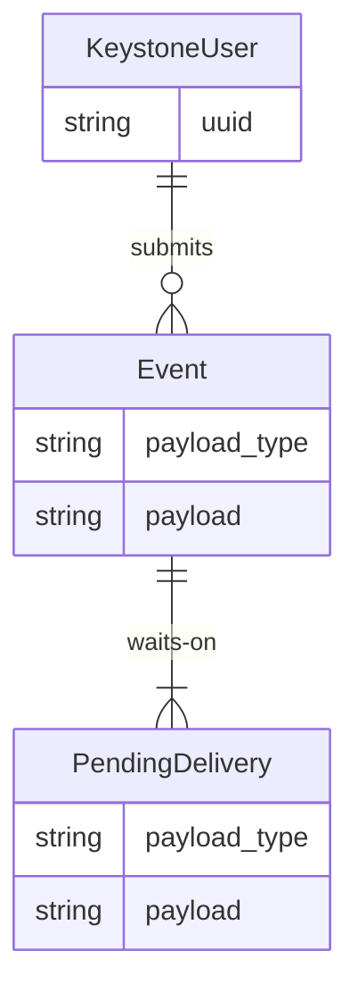

<!--
SPDX-FileCopyrightText: 2025 SAP SE
SPDX-License-Identifier: Apache-2.0
-->

# Tenso

Tenso is a microservice that is used within Converged Cloud to deliver and
translate application lifecycle events, most prominently regarding the
deployment of Helm releases.

The name comes from "tensō" (転送), which is Japanese for "data transfer".

## Data model

In this diagram, most database fields are elided for brevity.

Users can submit events via Tenso's own API. Once an event is submitted,
deliveries are scheduled according to the configured delivery routes. Since
the delivery of an event to a different system usually requires some sort of
data conversion, events and their deliveries each store their own payload and
the associated payload type information. For the event, the payload type is
provided by the user submitting the event to Tenso. For the delivery, the
target payload types are determined by Tenso's configuration.

## Usage

Build with `make`, install with `make install` or `docker build`. Run with
a single argument, either `api` or `worker`, to select whether to expose the
HTTP API or run the background worker jobs. Configuration is provided via
environment variables.

### Configuration

The following environment variables are understood by both API and worker:

| Variable | Default | Explanation |
| -------- | ------- | ----------- |
| `TENSO_DB_NAME` | `tenso` | The name of the database. |
| `TENSO_DB_USERNAME` | `postgres` | Username of the database user. |
| `TENSO_DB_PASSWORD` | *(optional)* | Password for the specified user. |
| `TENSO_DB_HOSTNAME` | `localhost` | Hostname of the database server. |
| `TENSO_DB_PORT` | `5432` | Port on which the PostgreSQL service is running on. |
| `TENSO_DB_CONNECTION_OPTIONS` | *(optional)* | Database connection options. |
| `TENSO_ROUTES` | *(required)* | Comma-separated list of enabled delivery routes. Each route is a pair of payload types, separated by `->`. For example, `foo.v1 -> bar.v2` means that events with payload type `foo.v1` will be accepted by Tenso's API and then converted into payload type `bar.v2` for delivery. [See below](#supported-payload-types) for supported payload types. |

The following environment variables are only understood by the API:

| Variable | Default | Explanation |
| -------- | ------- | ----------- |
| `OS_...` | *(required)* | A full set of OpenStack auth environment variables for Tenso's service user. See [documentation for openstackclient][os-env] for details. |
| `TENSO_API_LISTEN_ADDRESS` | `:8080` | Listen address for HTTP server. |
| `TENSO_OSLO_POLICY_PATH` | *(required)* | Path to the `policy.[json|yaml]` file for this service. [See below](#api-specification) for details. |

The following environment variables are only understood by the worker:

| Variable | Default | Explanation |
| -------- | ------- | ----------- |
| `TENSO_WORKER_LISTEN_ADDRESS` | `:8080` | Listen address for HTTP server (only for healthcheck and Prometheus metrics). |

## API specification

Tenso has an OpenStack-style API, so a Keystone token must be supplied in the
`X-Auth-Token` header of all requests. The Tenso API can be discovered as
service type "tenso" in the Keystone catalog.

To control API access, Tenso understands access rules in the
[`oslo.policy` JSON][os-pol-json] and [`oslo.policy` YAML][os-pol-yaml]
formats.

See also: [List of available API attributes](https://github.com/sapcc/go-bits/blob/53eeb20fde03c3d0a35e76cf9c9a06b63a415e6b/gopherpolicy/pkg.go#L151-L164)

### `POST /v1/events/new`

Submits an event to Tenso for delivery. The event payload must be supplied in
the request body, in whatever format is appropriate for that payload type. On
success, 202 (Accepted) is returned.

| Query parameter | Explanation |
| --------------- | ----------- |
| `payload_type` | **Required.** The payload type for this event. [See below](#supported-payload-types) for supported payload types. |

| Header | Explanation |
| ------ | ----------- |
| `X-Tenso-Routing-Info` | Optional Header, only read when this `payload_type` has a `TENSO_ROUTES`-entry enabled to deliver to ServiceNow. Currently, only values in this format are considered: `servicenow-target=dev`. When omitted, `servicenow-target=default` is assumed. For info on targets, see config below. |

The corresponding policy rule is `event:create`. The object attribute
`%(target.payload_type)s` can be used in this policy rule.

[os-env]: https://docs.openstack.org/python-openstackclient/latest/cli/man/openstack.html

[os-pol-json]: https://docs.openstack.org/oslo.policy/latest/admin/policy-json-file.html

[os-pol-yaml]: https://docs.openstack.org/oslo.policy/latest/admin/policy-yaml-file.html

### `POST /v1/events/synthetic`

Submits a synthetic event to Tenso for delivery. This endpoint works
identically to `POST /v1/events/new`, with two exceptions:

- Instead of reading the event payload in the request body, a hardcoded event
  payload with synthetic is used.
- The policy rule is `event:create_synthetic` instead of `event:create`.

This endpoint should be restricted to cloud admins. It can be used to test the
conversion and delivery path for an incoming payload type without having to
wait for an event to be submitted (or having to generate one manually).

## Supported payload types

### Helm deployments

When a Concourse pipeline performs a Helm deployment, we collect metadata and
status information about the deployment using our internal
concourse-release-resource. There are several payload types relating to this
event signaling process:

* `helm-deployment-from-concourse.v1` is supported on ingress and validates the
  event payload generated by the concourse-release-resource.
* `helm-deployment-to-elk.v1` forwards the payload into Logstash
  for archival purposes.
* `helm-deployment-to-swift.v1` forwards the payload into
  OpenStack Swift for archival purposes.
* `helm-deployment-to-servicenow.v1` forwards the payload into
  the Change Management area of our ServiceNow instance.

### AWX deployments

When an AWX deployment is performed, we support the following payload types:

* `infra-workflow-from-awx.v1` is supported on ingress and validates the event
  payload generated by our AWX workflows.
* `infra-workflow-to-swift.v1` forwards the payload into OpenStack
  Swift for archival purposes.
* `infra-workflow-to-servicenow.v1` forwards the payload into the
  Change Management area of our ServiceNow instance.

### Active Directory deployments

When a deployment to an Active Directory from a Concourse pipeline is performed, we support the following payload types:

* `active-directory-deployment-from-concourse.v[1-2]` is supported on ingress and validates the event
  payload generated by the Concourse pipeline.
* `active-directory-deployment-to-servicenow.v1` forwards the payload into
  the Change Management area of our ServiceNow instance.

### Terraform deployments

When a deployment to Terraform is performed from a Concourse pipeline, we support the following payload types:

* `terraform-deployment-from-concourse.v1` is supported on ingress and validates the event
  payload generated by the Concourse pipeline.
* `terraform-deployment-to-swift.v1` forwards the payload into OpenStack
  Swift for archival purposes.
* `terraform-deployment-to-servicenow.v1` forwards the payload into the
  Change Management area of our ServiceNow instance.

### Payload Types Configuration

To configure these delivery paths, the following environment variables are inspected:

| Variable | Default | Explanation |
| -------- | ------- | ----------- |
| `TENSO_AWX_WORKFLOW_SWIFT_CONTAINER` | *(required)* | The name of the target Swift container for `infra-workflow-to-swift.v1` delivery. |
| `TENSO_HELM_DEPLOYMENT_LOGSTASH_HOST` | *(required)* | The host:port pair of the Logstash service for `helm-deployment-to-elk.v1` delivery. |
| `TENSO_HELM_DEPLOYMENT_SWIFT_CONTAINER` | *(required)* | The name of the target Swift container for `helm-deployment-to-swift.v1` delivery. |
| `TENSO_TERRAFORM_DEPLOYMENT_SWIFT_CONTAINER` | *(required)* | The name of the target Swift container for `terraform-deployment-to-swift.v1` delivery. |
| `TENSO_SERVICENOW_MAPPING_CONFIG_PATH` | *(required)* | Path to a config file containing additional configuration for the mapping between incoming events and ServiceNow change events. |

The config file for `TENSO_SERVICENOW_MAPPING_CONFIG_PATH` must be a JSON document with the following fields:

| Field | Data type | Explanation |
| ----- | --------- | ----------- |
| `helm-deployment` | list of 1-n objects | Mapping rules for `helm-deployment-from-concourse.v1` translation to ServiceNow (see below). |
| `awx-workflow` | list of 1-n objects | Mapping rules for `infra-workflow-from-awx.v1` translation to ServiceNow (see below). |
| `active-directory-deployment` | list of 1-n objects | Mapping rules for `active-directory-deployment-from-concourse.v[1-2]` translation to ServiceNow (see below). |
| `terraform-deployment` | list of 1-n objects | Mapping rules for `infra-workflow-concourse-awx.v1` translation to ServiceNow (see below). |
| `regions.<region>` | list of strings | Availability zones belonging to this region. |
| `availability_zones.<az>.datacenters` | list of strings | Data centers belonging to this AZ, using the names that ServiceNow expects. |
| `availability_zones.<az>.environment` | string | Either "Development", "QA" or "Production". |
| `endpoints.<target>.url` | string | URL of a SNOW endpoint to receive changes. |
| `endpoints.<target>.client_cert` | string | X509 cert for authentication on this SNOW endpoint. |
| `endpoints.<target>.private_key` | string | X509 key for authentication on this SNOW endpoint. |

The lists of "mapping rule" objects mentioned above are used to set fixed default fields in ServiceNow API depending on context. 
They are evaluated in the order given in the config: for each individual field the last matched rule will be applied.
At least one mapping rule for a type of payload should match all changes. The rule structure is as follows:

| Field | Required (once in all matching rules for a payload type) | Data type | Explanation |
| ----- | -------------------------------------------------------- | --------- | ----------- |
| `match_summary` | no | Regex-string | If present, the rule only applies to changes whose summary matches this regular expression. A leading `^` and trailing `$` anchor are added automatically, thus the regex has to match the whole summary. |
| `match_servicenow_target` | no | string | If present, the rule only applies to changes whose `servicenow-target` (see `X-Tenso-Routing-Info`) matches this string.  |
| `change_template_id` | yes | string | Value for the `standard_change_template_id` which determines most static properties. |
| `assignee` | yes | string | SNOW technical user that we will put into `assigned_to`. |
| `responsible_manager` | yes | string | User ID (C/D/I) of the user that we will put as `responsible_manager`. |
| `service_offering` | yes | string | Value that we will put as `service_offering`. |
| `requester` | yes | string | User ID (C/D/I) of the user that we will put into `requested_by`. This content was previously used as `assigned_to` but that one has to be a technical user (see last section). |

If multiple mapping rules match, attributes set in later rules override those set in earlier rules. In other words, put the more general rules at the top and the more specific rules at the bottom.
