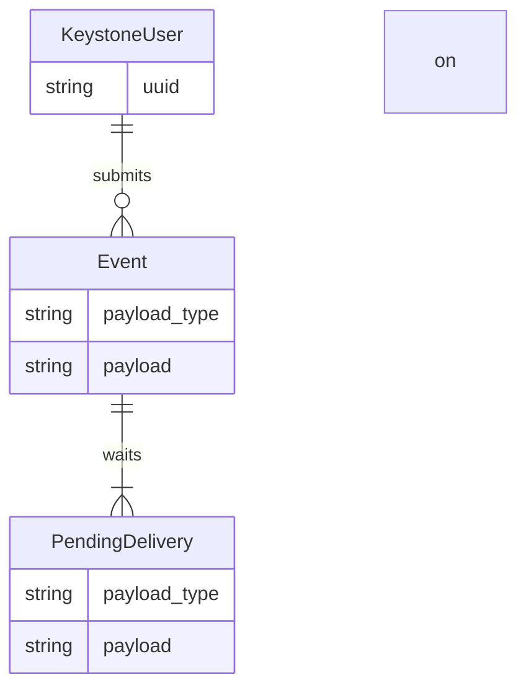

# Tenso

Tenso is a microservice that is used within Converged Cloud to deliver and
translate application lifecycle events, most prominently regarding the
deployment of Helm releases.

The name comes from "tensō" (転送), which is Japanese for "data transfer".

## Data model

In this diagram, most database fields are elided for brevity.

Users can submit events via Tenso's own API. Once an event is submitted,
deliveries are scheduled according to the configured delivery routes. Since
the delivery of an event to a different system usually requires some sort of
data conversion, events and their deliveries each store their own payload and
the associated payload type information. For the event, the payload type is
provided by the user submitting the event to Tenso. For the delivery, the
target payload types are determined by Tenso's configuration.

## Usage

Build with `make`, install with `make install` or `docker build`. Run with
a single argument, either "api" or "worker", to select whether to expose the
HTTP API or run the background worker jobs. Configuration is provided via
environment variables.

### Configuration

The following environment variables are understood by both API and worker:

| Variable | Default | Explanation |
| -------- | ------- | ----------- |
| `TENSO_DB_NAME` | `tenso` | The name of the database. |
| `TENSO_DB_USERNAME` | `postgres` | Username of the database user. |
| `TENSO_DB_PASSWORD` | *(optional)* | Password for the specified user. |
| `TENSO_DB_HOSTNAME` | `localhost` | Hostname of the database server. |
| `TENSO_DB_PORT` | `5432` | Port on which the PostgreSQL service is running on. |
| `TENSO_DB_CONNECTION_OPTIONS` | *(optional)* | Database connection options. |
| `TENSO_ROUTES` | *(required)* | Comma-separated list of enabled delivery routes. Each route is a pair of payload types, separated by `->`. For example, `foo.v1 -> bar.v2` means that events with payload type `foo.v1` will be accepted by Tenso's API and then converted into payload type `bar.v2` for delivery. [See below](#supported-payload-types) for supported payload types. |

The following environment variables are only understood by the API:

| Variable | Default | Explanation |
| -------- | ------- | ----------- |
| `OS_...` | *(required)* | A full set of OpenStack auth environment variables for Tenso's service user. See [documentation for openstackclient][os-env] for details. |
| `TENSO_API_LISTEN_ADDRESS` | `:8080` | Listen address for HTTP server. |
| `TENSO_OSLO_POLICY_PATH` | *(required)* | Path to the `policy.[json|yaml]` file for this service. [See below](#api-specification) for details. |

The following environment variables are only understood by the worker:

| Variable | Default | Explanation |
| -------- | ------- | ----------- |
| `TENSO_WORKER_LISTEN_ADDRESS` | `:8080` | Listen address for HTTP server (only for healthcheck and Prometheus metrics). |

## API specification

Tenso has an OpenStack-style API, so a Keystone token must be supplied in the
`X-Auth-Token` header of all requests. The Tenso API can be discovered as
service type "tenso" in the Keystone catalog.

To control API access, Tenso understands access rules in the
[`oslo.policy` JSON][os-pol-json] and [`oslo.policy` YAML][os-pol-yaml]
formats.

See also: [List of available API attributes](https://github.com/sapcc/go-bits/blob/53eeb20fde03c3d0a35e76cf9c9a06b63a415e6b/gopherpolicy/pkg.go#L151-L164)

### `POST /v1/events/new`

Submits an event to Tenso for delivery. The event payload must be supplied in
the request body, in whatever format is appropriate for that payload type. On
success, 202 (Accepted) is returned.

| Query parameter | Explanation |
| --------------- | ----------- |
| `payload_type` | **Required.** The payload type for this event. [See below](#supported-payload-types) for supported payload types. |

The corresponding policy rule is `event:create`. The object attribute
`%(target.payload_type)s` can be used in this policy rule.

[os-env]: https://docs.openstack.org/python-openstackclient/latest/cli/man/openstack.html
[os-pol-json]: https://docs.openstack.org/oslo.policy/latest/admin/policy-json-file.html
[os-pol-yaml]: https://docs.openstack.org/oslo.policy/latest/admin/policy-yaml-file.html

## Supported payload types

TODO
